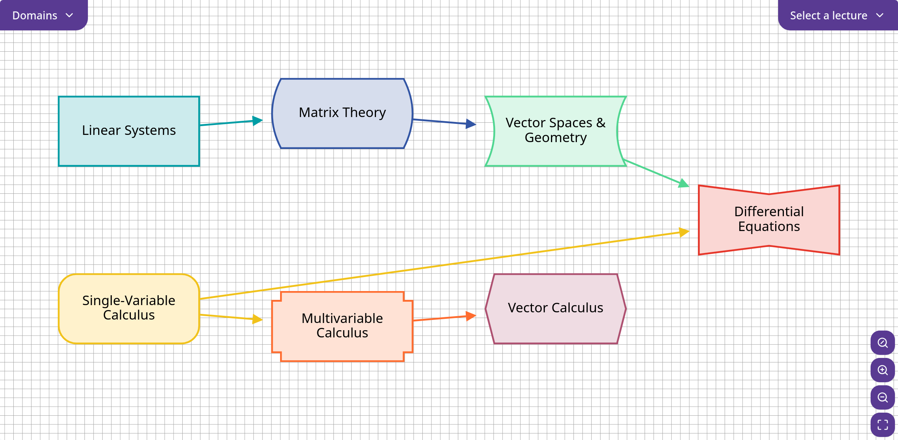

# PRIME Graph Editor

[](https://github.com/PRIME-TU-Delft/graaf/actions/workflows/check.yml)
[](https://github.com/PRIME-TU-Delft/graaf/actions/workflows/docker-build-push.yml)

## What this is

Course material rarely fits a single linear syllabus. Topics depend on each other, get reused
across courses, and get taught in a different order every year. The Graph Editor lets course staff
model that structure explicitly as a graph instead of a document: **domains** (broad topic areas)
connect to each other to show prerequisites, **subjects** live inside a domain, and **lectures**
group subjects into what's actually taught in a session.



Try it live: https://beta.prime-applets.ewi.tudelft.nl/graph/example

Graphs belong to a **course**, and courses can optionally belong to one or more **programmes**
(e.g. a faculty's degree programme), which is how staff and permissions are organized. A finished
graph can be shared with students as a read-only **link** or embedded as an iframe elsewhere (e.g.
Brightspace), without giving the viewer edit access or requiring them to log in.

See the [manual](https://prime-tu-delft.github.io/graaf/) for a full walkthrough of these
workflows.

## How it's built

- **[SvelteKit](https://svelte.dev/)** + TypeScript for the app itself.
- **[Prisma](https://www.prisma.io/)** over PostgreSQL for the data layer (programmes, courses,
  graphs, domains, subjects, lectures, links, users and roles).
- **[Auth.js](https://authjs.dev/)** (`@auth/sveltekit`) for authentication.
- **[D3](https://d3js.org/)** for rendering and laying out the graphs themselves.
- **Tailwind CSS** + **[bits-ui](https://www.bits-ui.com/)** for styling and UI primitives.
- **Zod** + `sveltekit-superforms` for form validation.

## Links

- **App:** https://beta.prime-applets.ewi.tudelft.nl
- **Manual:** https://prime-tu-delft.github.io/graaf/, a how-to guide for course staff, programme
  staff and TAs
- **Issues:** https://github.com/PRIME-TU-Delft/graaf/issues

## Installation

Create an .env file in the root of the project from the example and fill it in:

```bash
cp .env.example .env
```

```bash
# Terminal 1
cd db
podman compose up db # Or docker compose up db

# Terminal 2
pnpm install

pnpm prisma generate # will generate the prisma client
pnpm prisma db push # will setup the database schema
pnpm prisma db seed # will setup the database with some initial data
```

## Usage

```bash
# Terminal 1 - if not already running
cd db
podman compose up # Or docker compose up

# Terminal 2
pnpm dev
```

### Running with test users

```bash
pnpm run dev:testusers
```

## Testing

```bash
pnpm test:integration
```

Integration tests run against seeded test data that exercises the permission hierarchy described
above: three test programmes with different admin/editor roles, three test courses linked into
them with their own separate roles, and one graph (`GraphOne`) that's copied into the other two
courses to check that a graph's content is independent once copied. See
[`prisma/seed.ts`](prisma/seed.ts) for the full fixture.

Spins up a `db-test` service (via podman/docker compose), pushes the Prisma schema, seeds
the fixture, then runs `src/lib/server/actions/tests/**/*.test.ts` against it. Runs in CI on
every push and pull request (`.github/workflows/check.yml`, `integration-tests` job) against a
Postgres service container instead of compose.
