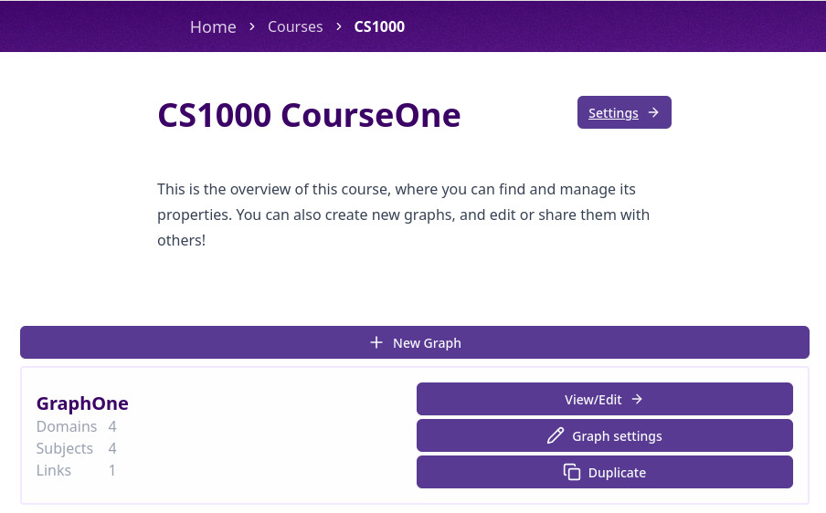
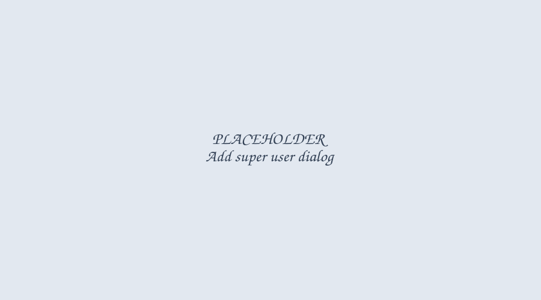
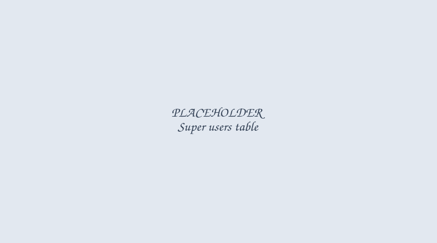
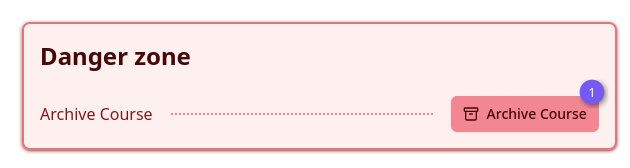

import { Aside } from '@astrojs/starlight/components';
import { APP_HOST } from '../../consts';

Courses hold the graphs, links and super users for a single subject. This page covers what course
staff (course admins and editors) can do. Programme-level management is covered on the
[Programmes](/programmes) page.

## Viewing a course

All courses you have access to are listed on the
<a href={APP_HOST + '/graph-editor/courses'}>Courses page</a>, grouped into "My Pinned
Courses", "All Courses" and "Archived Courses". Use the search bar to find a course by code or
name. Click the pin icon on a course to add or remove it from your pinned list.

Click "View" (or "View/Edit" if you have edit permissions) on a course card to open its overview
page, which lists the course's graphs.

_Figure 1: Course overview_

<Aside type="note">
	If you don't have access to a course, the overview page shows its admins and editors instead of
	its graphs, with a button to email them and request access.
</Aside>

## Course settings

<Aside type="caution">
	Only course admins, course editors, and programme admins/editors can open the course settings
	page.
</Aside>

Click "Settings" on a course card, or "Settings →" on the course overview page, to open course
settings.

_Figure 2: Course settings_

From here you can rename the course, manage super users, see the course's graphs, and (if the
course is archived) delete it.

### Course roles

- **Course Admins** can manage course settings, permanently delete graphs and links, and archive
  the course.
- **Course Editors** can create and edit graphs and links, but not delete them.
- **Programme Admins & Editors** implicitly have admin permissions for every course in their
  programme.

### Add or change super users

Only course admins and programme admins/editors can add super users or change roles — course
editors cannot.

Click "Add Super Users" to add a user: search for them, then check "User is allowed admin
permissions" to add them as an admin, or leave it unchecked to add them as an editor.

_Figure 3: Add super user_

To change an existing super user's role, click their "Admin" or "Editor" badge in the table and
choose a new role from the menu. The same menu lets you remove their access entirely (requires a
confirmation click).

_Figure 4: Super users table_

### Archiving and deleting a course

<Aside type="caution">
	Deleting a course requires programme admin/editor permissions on one of its programmes, and the
	course must already be archived. This is a step above what course admins alone can do.
</Aside>

Course admins can archive or restore a course from the settings page's danger zone — this hides it
from the default course list without deleting anything.

_Figure 5: Archive/delete course_

Once a course is archived, a "Delete Course" option appears for users with programme admin/editor
permissions. Deleting a course is permanent: it removes the course, its graphs and its links, and
breaks any embeds for that course.
