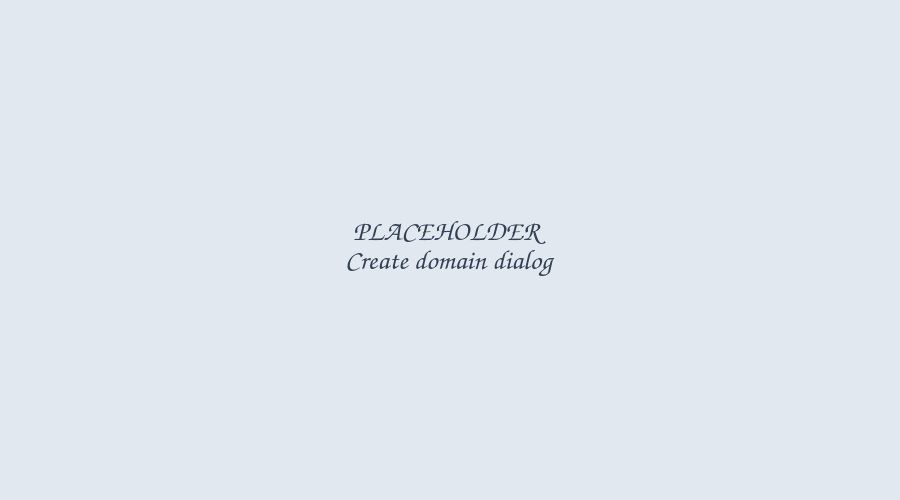
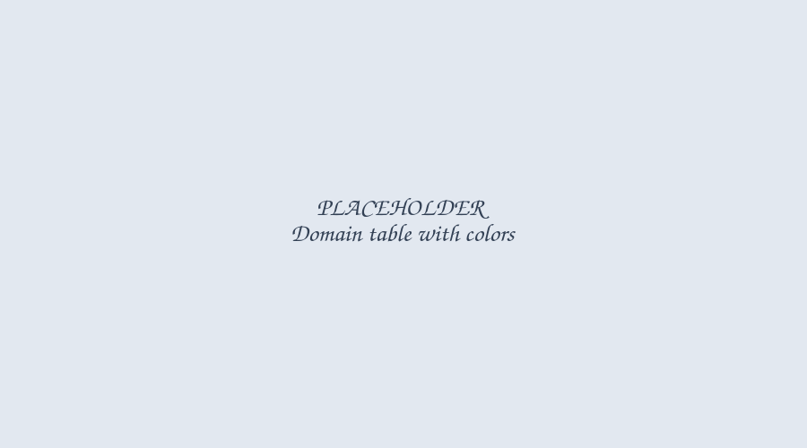
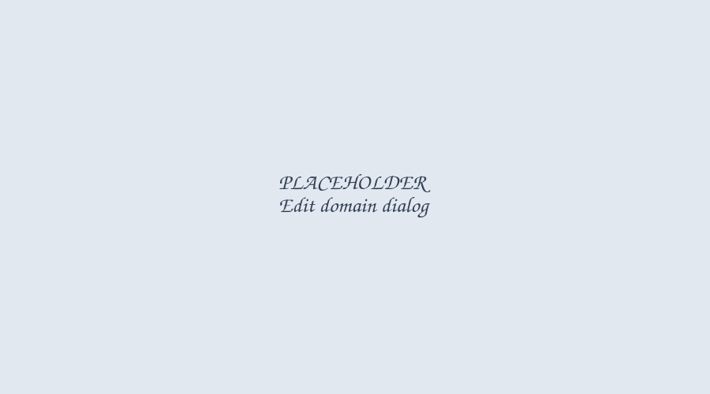
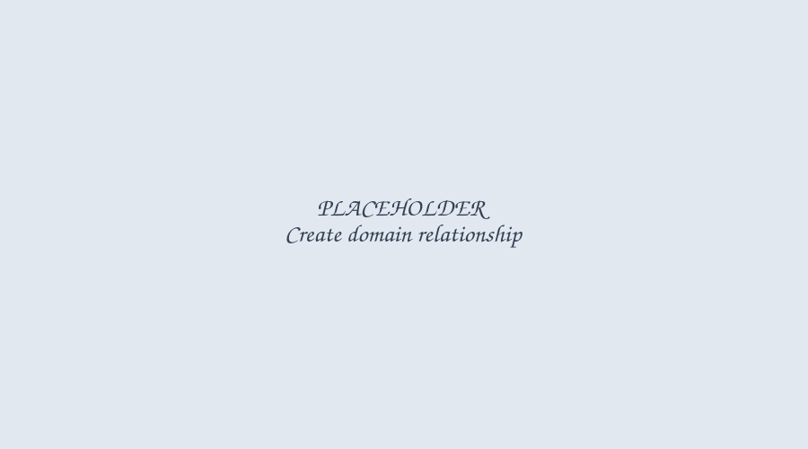
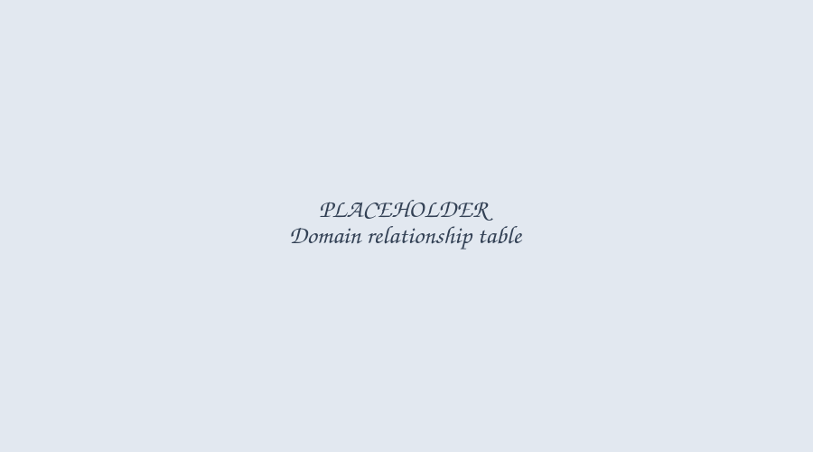

import { Aside } from '@astrojs/starlight/components';

A domain is a collection of subjects that are related to each other. Domains are the top-level
building blocks of a graph, and the arrows between them (domain relationships) form the graph's
overall structure.

<Aside type="caution">
	Managing domains and domain relationships requires course editor permissions or higher.
</Aside>

## Creating a domain

Open a graph's Domains tab (the default tab) and click "New Domain". Give it a name, and
optionally pick a style — a color used to distinguish the domain in the graph preview.

_Figure 1: Create domain_

New domains appear in a table, showing their name, style, and any validation issues.

_Figure 2: Domain table_

You can drag rows to reorder domains. You can also click a domain's color swatch directly in the
table to change its style without opening the edit dialog.

## Editing or deleting a domain

Click the ellipsis menu on a domain's row and choose "Edit" to rename it, change its style, or
delete it.

_Figure 3: Edit domain_

Deleting a domain also removes any domain relationships it's part of and unlinks it from any
subjects assigned to it — the confirmation dialog tells you exactly what will be affected before
you confirm.

<Aside type="note">
	If someone else edits the graph at the same time as you, you may see a "graph has changed"
	error when deleting. Reload the page and try again.
</Aside>

## Domain relationships

Once a graph has at least one domain, a "Domain Relationships" section appears below the domain
table. Click "New Relationship" and pick a source and target domain to connect them.

_Figure 4: Create relationship_

Relationships are listed in their own table. Click a relationship's source or target cell to
re-point it to a different domain, or use the trash icon to delete it.

_Figure 5: Relationship table_
