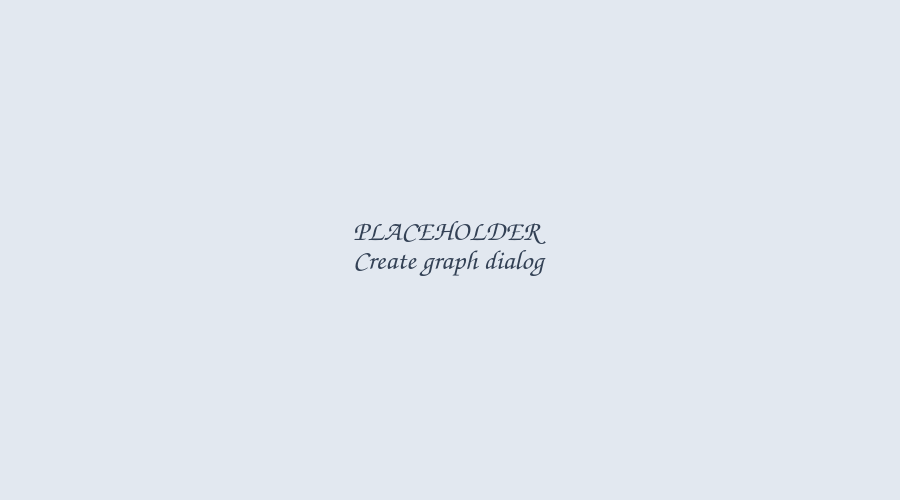
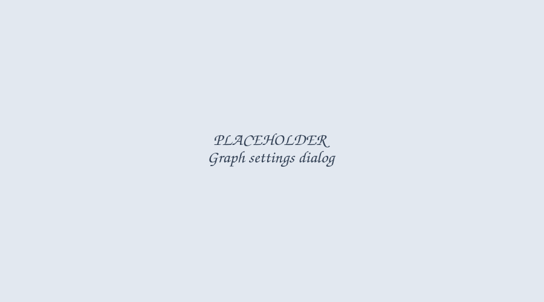
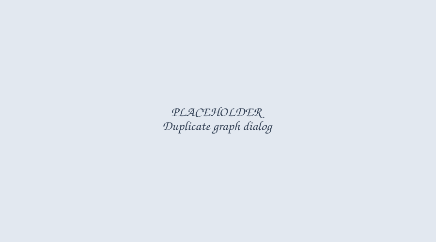

import { Aside } from '@astrojs/starlight/components';

A graph is a collection of domains, subjects and lectures, usually pertaining to the same field of
study within a course.

<Aside type="caution">
	Creating, editing and duplicating graphs requires course editor permissions or higher. If you
	only have view access, ask a course admin or editor for help.
</Aside>

## Creating a graph

On the course overview page, click "New Graph" and give it a name.

_Figure 1: Create graph_

The new graph appears as a card on the course overview page, showing its domain, subject and link
counts. Click "View/Edit →" to open it — this takes you straight to the graph's Domains tab.

## Graph settings

Click "Graph settings" on a graph's card (or the settings button next to it in the course
settings' graph table) to rename the graph.

_Figure 2: Graph settings_

<Aside type="note">
	Deleting a graph from this dialog requires course **admin** permissions, not just editor —
	course editors can create and edit graphs but not delete them.
</Aside>

## Duplicating a graph

Click "Duplicate" on a graph's card to copy it, including all its domains, subjects and lectures,
into any course or sandbox you have edit access to.

_Figure 3: Duplicate graph_

The new graph's name defaults to "\{original name} copy". If a graph with the same name already
exists in the destination, you'll see a warning, but you can still proceed — this is a warning, not
a hard rule against duplicate names.

## Inside a graph

Once you're editing a graph, use the "Change view" dropdown to switch between the Domains,
Subjects and Lectures tabs. A live preview of the graph is shown alongside the editor and can be
hidden with the "Show/Hide Preview" toggle.

See the [Domains](/domains), [Subjects](/subjects) and [Lectures](/lectures) pages for how to
build out a graph's content, and the [Links](/links) page for sharing a finished graph.
