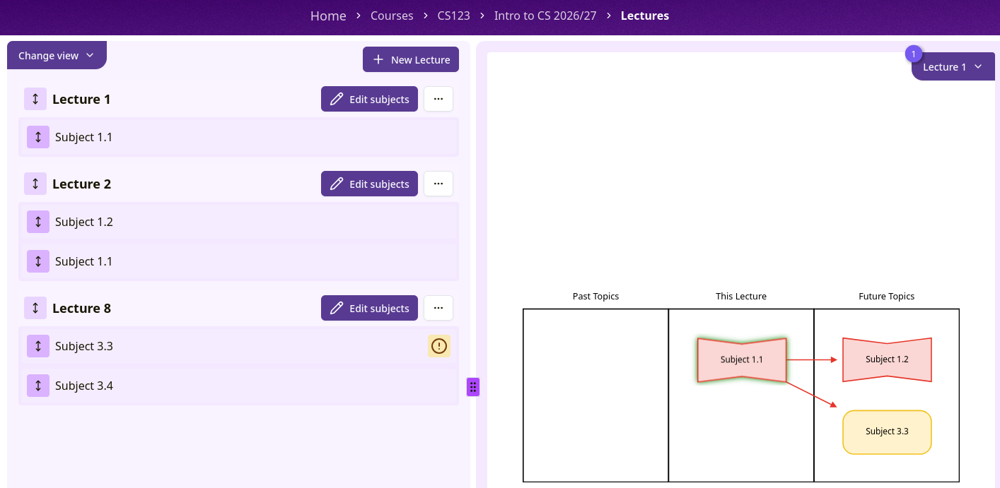

import { Aside } from '@astrojs/starlight/components';

A lecture stores a set of subjects, letting students (and the graph preview) focus on just the
subjects covered in that lecture. By clicking on the "Lecture" button (1) in the top-right, you can select which lecture view do you want to preview.

_Figure 1: Lecture view_

## Creating a lecture

Open a graph's Lectures tab and click "New Lecture". Give it a name.

_Figure 2: Create lecture_

<Aside type="note">
	Creating a lecture only requires course editor permissions. Editing its name, deleting it, or
	changing which subjects it contains requires course **admin** permissions. A course editor who is
	not an admin can add a lecture but can't change it afterwards. Ask a course admin if you need one
	of these done.
</Aside>

## The lecture list

Lectures are shown as cards you can drag using the handle (1) to reorder.

_Figure 3: Lecture list_

Each card's ellipsis menu (2) has "Edit" (rename or delete the lecture) and "Delete" options.

## Assigning subjects to a lecture

Click "Add subjects" (or "Edit subjects" once a lecture already has some) on a lecture's card to
open a checklist of every subject in the graph. Check the subjects that belong to this lecture and
submit. This replaces the lecture's full subject list with your selection.

_Figure 4: Assign subjects to a lecture_

Once a lecture has subjects, you can also reorder them by dragging within the lecture's card, or
drag a subject from one lecture directly into another to move it across.

<Aside type="caution">
	Deleting a lecture unlinks its subjects but does not delete the subjects themselves or warn you
	beforehand. Unlike deleting a domain or subject, there's no "this will affect N things" message.
</Aside>
