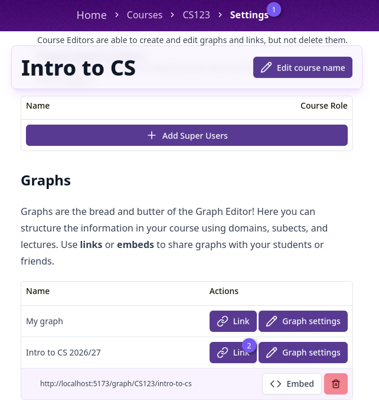
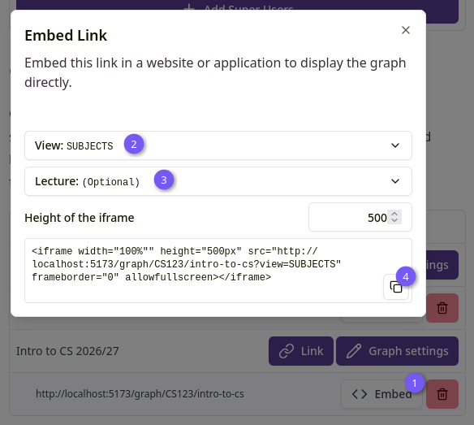

import { Aside } from '@astrojs/starlight/components';

A link (or "alias") lets you share a graph with anyone, without giving them edit access or
requiring them to log in. Links can also be embedded as an iframe in another website.

## Creating a link

Click the "Link" button next to a graph, either on the course overview page or in the course
settings' graph table, and give it a short name (up to 12 characters, letters, numbers and `-`
only).

_Figure 1: Create link_

<Aside type="caution">Creating a link requires course editor permissions or higher.</Aside>

The resulting public URL is `{course code}/{link name}` under the app's `/graph/` path, for example
`/graph/WBMT1050/exam1`. Anyone with this URL can view the graph but cannot edit it.

## Managing links

A graph's links are listed in the course settings' graph table as sub-rows, showing the full
shareable URL.

_Figure 2: Link table_

<Aside type="note">
	Deleting a link requires course **admin** permissions. A course editor can create links but not
	delete them, matching the same admin/editor split used elsewhere in a course.
</Aside>

## Embedding a link

Click "Embed" next to a link to get an `<iframe>` snippet you can paste into another page, for
example a Brightspace module.

_Figure 3: Embed link_

Choose which view to embed (Domains, Subjects, or Lectures if the graph has any), optionally scope
it to a single lecture, and set the iframe's height. Copy the generated snippet with the copy
button.

## What visitors see

Visiting a link's public URL shows just the graph itself, in read-only mode, with no course or
graph editor chrome around it. If the link doesn't exist, visitors see a "Graph not found" page.
