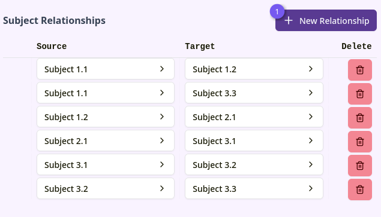

import { Aside } from '@astrojs/starlight/components';

A subject is a topic or concept within a domain. Subjects sit one level below domains, and are
what gets assigned to lectures.

<Aside type="caution">
	Managing subjects and subject relationships requires course editor permissions or higher.
</Aside>

## Creating a subject

Open a graph's Subjects tab and click "New Subject". Give it a name and, optionally, link it to a
domain right away.

_Figure 1: Create subject_

<Aside type="note">
	If the graph has no domains yet, the domain field is disabled. Create a domain first on the
	[Domains](../domains) tab.
</Aside>

Subjects appear in a table showing their name, linked domain, and any validation issues (1).

_Figure 2: Subject table_

You can drag rows (2) to reorder subjects.

## Assigning a subject to a domain

Click the Domain column for a subject to open a dropdown listing every domain in the graph.
Selecting one immediately re-assigns the subject, there's no separate save step. Choose "None" to
unlink it from any domain.

A subject that has no domain assigned shows an orange "Choose domain" prompt in this column until
you set one.

## Editing or deleting a subject

Click the ellipsis menu on a subject's row and choose "Edit" to rename it, change its linked
domain, or delete it.

_Figure 3: Edit subject_

Deleting a subject also removes any subject relationships it's part of. The confirmation dialog
tells you how many will be affected before you confirm.

## Subject relationships

Once a graph has at least one subject, a subject relationships section appears below the subject
table, working the same way as [domain relationships](../domains#domain-relationships): click "New
Relationship", pick a source and target subject, and manage the resulting connections in the table
below.

_Figure 4: Subject relationships_
